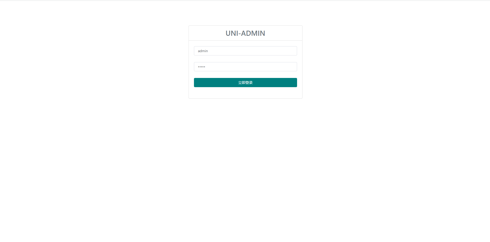
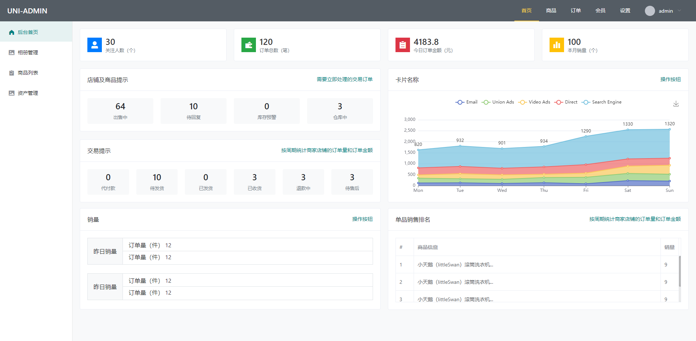
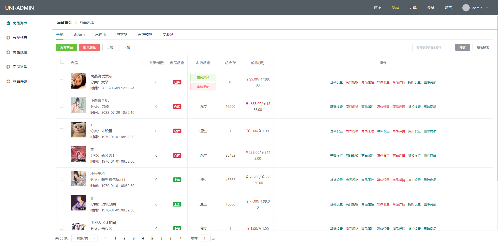
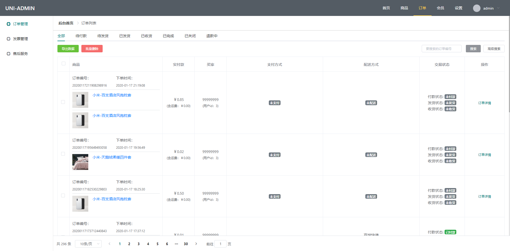
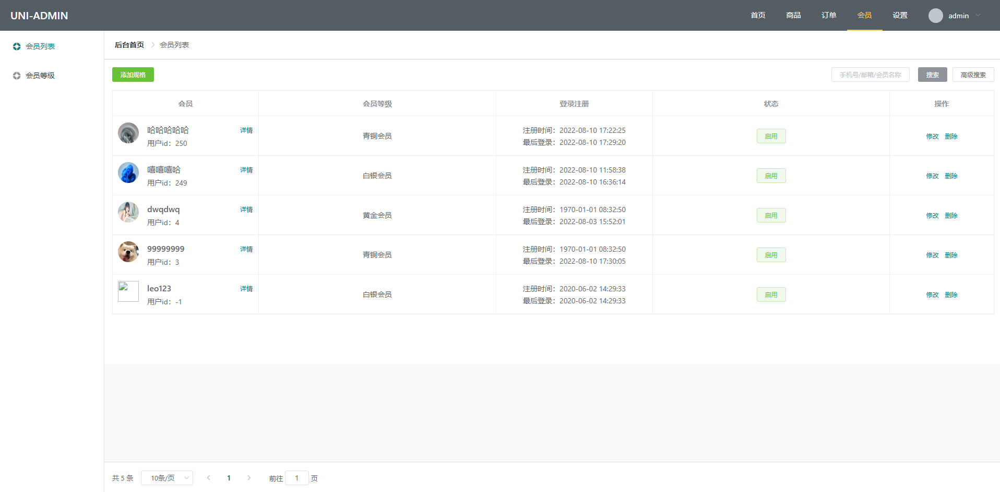
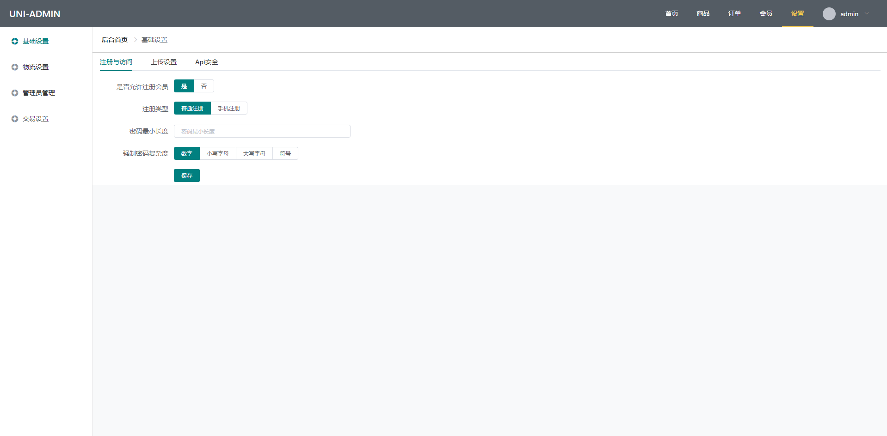

# vue-el-admin

## Project setup

```
yarn install
```

### Compiles and hot-reloads for development

```
yarn serve
```

### Compiles and minifies for production

```
yarn build
```

### Lints and fixes files

```
yarn lint
```

### Customize configuration

See [Configuration Reference](https://cli.vuejs.org/config/).

## 项目预览图
###登录页


### 首页


### 商品页面


### 订单页面


### 会员页面


### 设置页面


